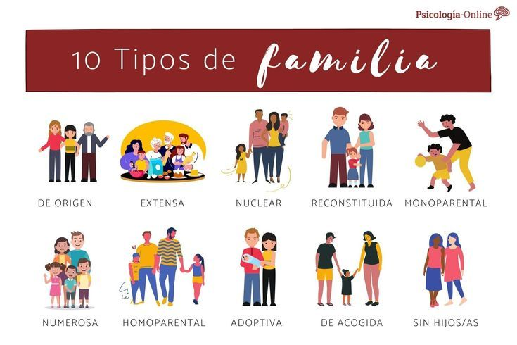

<html>
<head>
 <title> LA IMPORTANCIA DE LA FAMILIA </title>
</head>
<body bgcolor="purple">

 <h1 style="color:white"> LA IMPORTANCIA DE LA FAMILIA </h1>

 
 ALUMNA: Maite Franco   

 
 La familia es el grupo de personas más importante en la vida de cualquier ser humano. Se considera el núcleo fundamental de la sociedad, ya que es el primer entorno donde recibimos amor, protección y educación. Un entorno familiar seguro nos brinda el apoyo necesario para aprender a relacionarnos con los demas y desarrollar nuestros valores esenciales. 

 <h1 style="color:white"> Tipos de Familia </h1>

 <ul style="color:white">
  <li><strong>Familia Nuclear:</strong> Formada por los dos progenitores (madre y padre) y sus hijos.</li>
  <li><strong>Familia Extendida:</strong> Abarca a varios parientes consanguíneos como abuelos, tíos, primos o sobrinos viviendo en el mismo hogar.</li>
  <li><strong>Familia Monoparental:</strong> Constituida por un solo progenitor (solo la madre o solo el padre) que asume la crianza de los hijos.</li>
  <li><strong>Familia Ensamblada (o Reconstituida):</strong> Se genera cuando uno o ambos miembros de la pareja actual tienen hijos de relaciones anteriores.</li>
  <li><strong>Familia Homoparental:</strong> Formada por una pareja de dos hombres o dos mujeres que se convierten en progenitores mediante adopción o métodos asistidos.</li>
  <li><strong>Familia Adoptiva:</strong> Una pareja o una persona soltera que recibe la tutela legal de uno o más niños que no son sus hijos biológicos.</li>
  <li><strong>Familia Sin Hijos:</strong> Formada por una pareja que, por elección propia o por motivos biológicos, decide no tener descendencia.</li>
  <li><strong>Familia de Acogida:</strong> Un hogar temporal donde una familia cuida a niños que no pueden vivir con sus padres biológicos por un tiempo.</li>
  <li><strong>Familia Compuesta:</strong> Es aquella que se caracteriza por estar compuesta por una familia nuclear o extendida más personas que no tienen ningún parentesco con ellos (como amigos o ahijados viviendo juntos).</li>
  <li><strong>Familia Unipersonal:</strong> Formada por un solo integrante que vive de manera independiente sin ningún otro pariente en el hogar.</li>
 </ul>

 <h1 style="color:white"> Valores Familiares Esenciales </h1>

 
 Los valores son las reglas y principios que guian nuestro comportamiento dentro y fuera de casa. Los mas destacados son: 

 <ul style="color:white">
  <li>El Amor: El lazo mas fuerte que mantiene unidos a todos los miembros de la familia. </li>
  <li>El Respeto: La capacidad de escuchar y aceptar las opiniones y diferencias de cada uno. </li>
  <li>La Honestidad: Decir siempre la verdad para construir confianza mutua dentro del hogar. </li>
  <li>La Solidaridad: El apoyo mutuo y el trabajo en equipo cuando alguien atraviesa un momento dificil. </li>
 </ul>

</html>
